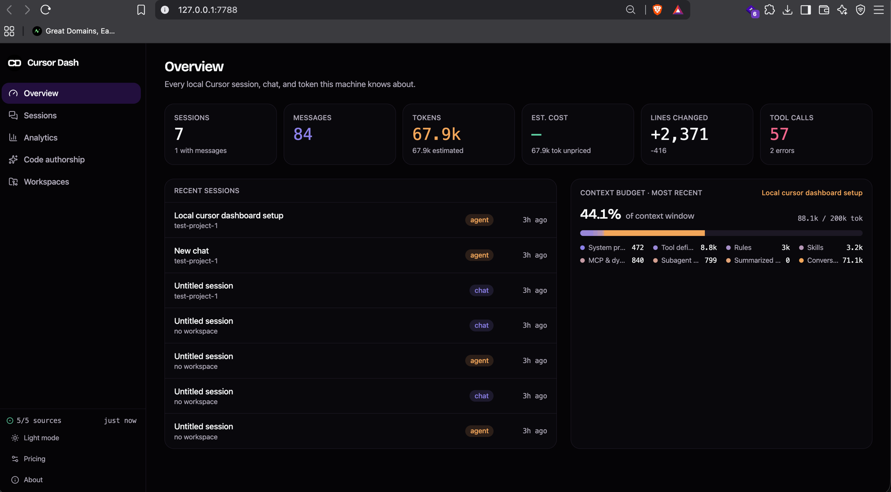

# cursor-dash

[](https://www.npmjs.com/package/@darshanpatel2608/cursor-dash)
[](./package.json)

A local, read-only dashboard for your [Cursor](https://cursor.com) session history — every chat, tool call, token, and estimated cost, indexed straight from Cursor's own on-disk data. Nothing leaves your machine.



## Install

Run it directly, no install required:

```sh
npx @darshanpatel2608/cursor-dash@latest
```

Or install it globally to get a `cursor-dash` command:

```sh
npm install --location=global @darshanpatel2608/cursor-dash
```

then run it from anywhere:

```sh
cursor-dash
```

Either way: it scans Cursor's local data stores, starts a server on `127.0.0.1`, and opens the dashboard in your browser.

## What it shows

- **Every session** across all your Cursor workspaces — agent and chat, archived and draft, with filters for date range, workspace, model, mode, status, errors, tool calls, token range, lines changed, and more.
- **Full transcripts** — user/assistant messages, collapsible thinking blocks, expandable tool calls with arguments and results, syntax-highlighted code, diffs, todos, and errors.
- **The context-window budget** — Cursor tracks exactly what's competing for a session's context (system prompt, tools, rules, skills, MCP, subagents, summarized history, live conversation) and exposes it nowhere. cursor-dash renders it as a stacked meter, at three scales: a sparkline in each session row, the full breakdown in a session's header, and a small-multiples grid in Analytics.
- **Tokens and cost, honestly labelled.** Cursor stores no dollar amounts locally, only token counts, and even those are measured on a minority of messages. Every number carries a provenance tag — `measured`, `reported` (a context-window snapshot, not cumulative spend), or `estimated` (a character-count heuristic) — surfaced in the UI rather than hidden. Cost is computed from an editable price table (sidebar → Pricing) that can also refresh itself from Cursor's published pricing docs; unpriced models show as "unpriced," never silently as $0.
- **Analytics** — usage over time, model mix, tool call frequency and error rates, context pressure across every session.
- **Code authorship** — AI vs. human lines per commit and per file extension, from Cursor's own AI-code-tracking database.
- **Workspaces** — every project folder Cursor has run a session in, with rollups.
- **Live updates** — the dashboard refreshes automatically as you use Cursor, via a small local change feed.

## How it works

A Node server (`server/`) reads Cursor's local SQLite stores and transcript files — never writing to them — normalizes everything into stable shapes, and serves both a JSON API and the built dashboard from one process. No native dependencies: it uses Node's built-in `node:sqlite` where available and falls back to a pure-WASM SQLite (`sql.js`) otherwise, so it works without a compiler toolchain on macOS, Windows, or Linux.

Data sources read (all optional — a missing one just degrades that panel):

| Source | Path (macOS / Windows) |
|---|---|
| Session index & messages | `~/Library/Application Support/Cursor/User/globalStorage/state.vscdb` · `%APPDATA%\Cursor\User\globalStorage\state.vscdb` |
| Full-text search | `.../globalStorage/conversation-search.db` |
| AI code-authorship tracking | `~/.cursor/ai-tracking/ai-code-tracking.db` |
| Raw agent transcripts | `~/.cursor/projects/*/agent-transcripts/*/*.jsonl` |
| Per-workspace legacy activity | `.../User/workspaceStorage/*/state.vscdb` |

> **Windows note:** every path is built with `path.join` from platform-detected roots and the code has been reviewed for POSIX-only assumptions, but it has only been *run* on macOS during development. If something doesn't resolve correctly on Windows, please file an issue.

## CLI options

```
cursor-dash [options]

  -p, --port <n>     Port to listen on (default: 7788, auto-increments if taken)
      --data-dir <p> Override the Cursor data directory to scan
      --no-open      Don't open the dashboard in a browser
      --cloud        Enable the optional live Cursor usage sync (reads your local
                      Cursor auth token and calls cursor.com — off by default)
      --share        Expose the dashboard on a public HTTPS URL via a free
                      Cloudflare Quick Tunnel, gated by a one-time 8-character
                      access code. Nothing to install or sign up for — the
                      tunnel binary downloads itself on first use.
      --share-url <u> Use a tunnel you already run (ngrok, tailscale funnel, a
                      named cloudflared tunnel) instead of starting one; the
                      access-code gate still applies.
  -h, --help          Show help
  -v, --version       Show the version
```

(`npx @darshanpatel2608/cursor-dash@latest [options]` works the same way if you didn't install it globally.)

## Sharing your dashboard

`--share` is for a team lead who wants to watch a teammate's Cursor usage remotely: cursor-dash only ever reads the *host machine's* data, so the person whose usage is being watched runs the command, not the person watching. They start it with `cursor-dash --share`, get back a public URL and an 8-character code:

```
  Shared publicly at  https://random-words-here.trycloudflare.com
  Access code         K7M2QX4P
```

and send both to whoever should see the dashboard. No account, no config, no port forwarding on either end — the tunnel is a free [Cloudflare Quick Tunnel](https://developers.cloudflare.com/cloudflare-one/networks/connectors/cloudflare-tunnel/do-more-with-tunnels/trycloudflare/), set up automatically via [`untun`](https://github.com/unjs/untun).

A few things worth knowing before you send that link:

- **Anyone with the code has full access** — every session, transcript, and file diff on that machine, the same as sitting at the keyboard. There's no read-only mode. Don't share it with anyone you wouldn't hand your Cursor history to directly.
- **The link and code are ephemeral.** Both are generated fresh every time you run `--share` and stop working the moment you `Ctrl-C` the process — nothing is written to disk.
- **Quick Tunnels come with Cloudflare's own caveats:** no uptime SLA, a 200-concurrent-request ceiling, and they're explicitly meant for testing/development rather than production traffic. For casual team use this is a non-issue; for anything that needs to stay up reliably, run your own tunnel (ngrok, Tailscale Funnel, a named `cloudflared` tunnel) and pass its URL with `--share-url`.
- Your own use at `http://127.0.0.1:<port>` is completely unaffected — the code is only ever required for requests arriving through the public URL.

## Privacy

By default, everything runs on `127.0.0.1` and only accepts loopback requests — that stays true unless you explicitly pass `--share` or `--share-url`, which trade that guarantee for the public-URL-plus-code model described above. cursor-dash reads Cursor's local databases through snapshot copies — it never opens them for writing, never touches them mid-write — and nothing you type or that Cursor recorded leaves your machine on its own. Three narrow exceptions, all explicit opt-ins:

- **Refresh pricing** (sidebar → Pricing → Refresh pricing) fetches Cursor's public pricing docs page to update the cost-estimate table. No account data is sent — it's the same request your browser makes loading that page.
- **`--cloud`** enables an unofficial cursor.com usage endpoint that reads your local Cursor auth token. It's off by default and has to be started explicitly with that flag.
- **`--share` / `--share-url`** puts the dashboard on a public URL, as above. Traffic to a Cloudflare Quick Tunnel is TLS-terminated at Cloudflare's edge like any other site behind Cloudflare.

## Development

```sh
git clone https://github.com/darshan260802/cursor-dash.git
cd cursor-dash
bun install
bun run dev         # Vite dev server on :5173, proxying /api to :7788
bun run dev:server  # the API server, in another terminal
bun run build        # builds dist/
bun start             # runs the built app end-to-end (same as `cursor-dash`)
```

## License

MIT
